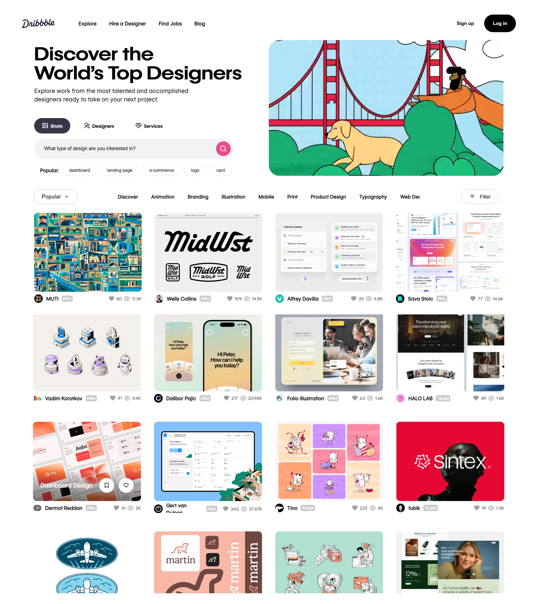
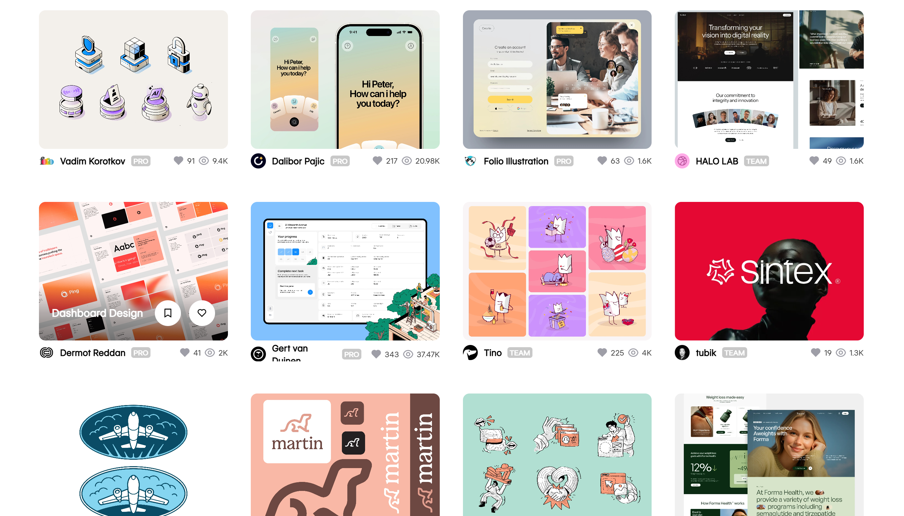
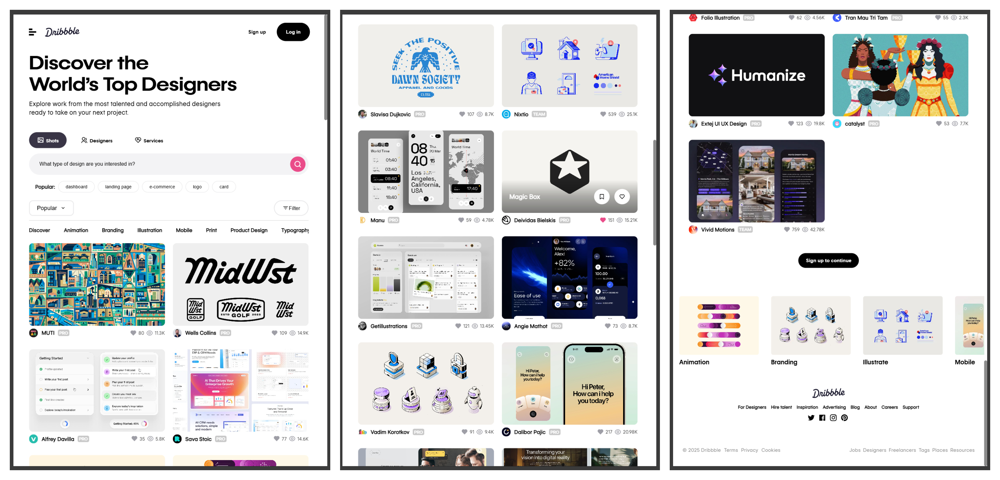
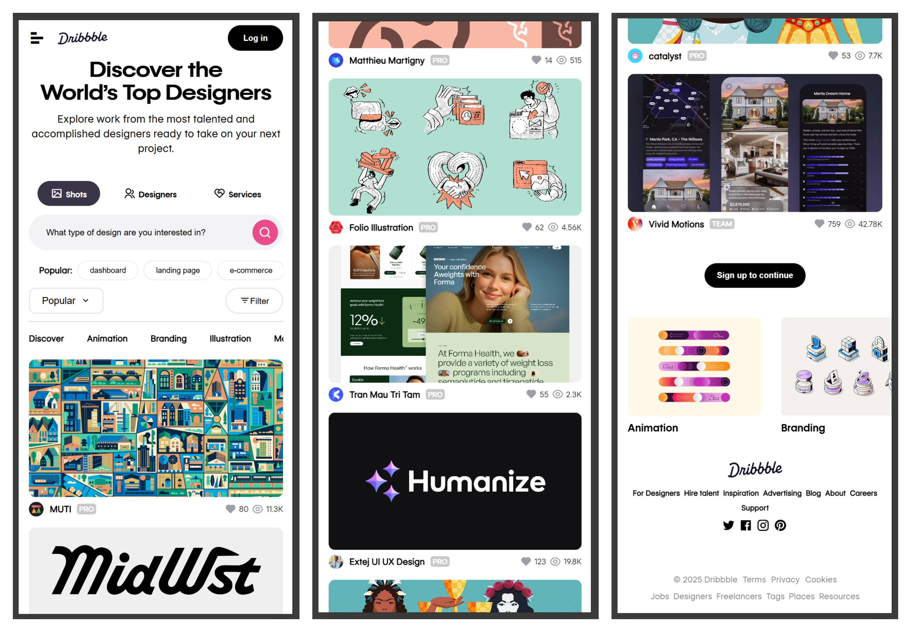

# 🎨 Dribbble Clone (HTML + CSS Only)

A **fully responsive, pixel-perfect Dribbble clone** built using **pure HTML and CSS** — no frameworks, no libraries.  
This project is designed to perfectly fit **any screen width** — from **mobile** 📱 to **tablet** 📟 to **laptop/desktop** 💻.

---

## 🚀 Features
- 📱 **100% Responsive Design** – Works seamlessly on mobile, tablet, and laptop/desktop  
- 🎯 **Pixel Perfect Layout** – Closely replicates the original Dribbble UI  
- 🛠 **Pure HTML & CSS Only** – No external libraries or frameworks  
- 🎥 **Demo Video** – Showcasing responsiveness across all devices  
- 📸 **Screenshots** – Included for laptop and mobile views  

---

## 📂 Project Structure
├── index.html # Main HTML file
├── style.css # Main CSS file
├── assets/ # Screenshots, demo video, and other assets
└── README.md # Project documentation


---

## 📸 Screenshots
### 💻 Laptop View  



### 📟 Tablet View  


### 📱 Mobile View  


---

## 🎥 Demo Video
👉 [Watch Demo](https://drive.google.com/file/d/1rWdQgDb8OBM6-EpwsW8yAZItepXG2zg7/view?usp=drive_link)

---

## 🌐 Live Demo
🔗 [Live Site](https://vadik-x.github.io/Dribbble-Clone/)

---

## ⚙️ Tech Stack
- **HTML5**
- **CSS3 (Flexbox)**

---

## 📌 How to Use
1. Clone this repo:
   ```bash
   git clone https://github.com/Vadik-x/Dribbble-Clone

---

🙌 Acknowledgments

Inspired by Dribbble and built purely for learning and practice.

---

⭐ Support

If you found this project useful, don’t forget to ⭐ the repo!
